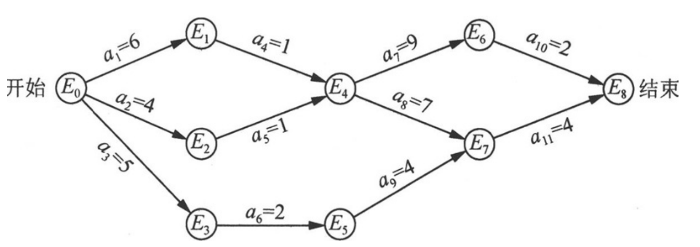

活动网络可以用来描述生产计划、施工过程、生产流程、程序流程等工程中各子工程的安排问题。

活动网络可分为两种：AOV网络和AOE网络。

# AOV网络
在AOV网络中，如果存在有向边＜u，v＞，则活动u必须在活动v之前进行，并称u是v的直接前驱（Immediate Predecessor），v是u的直接后继（Immediate Successor）。如果存在有向路径＜u，u1 ，u2 ，…，un，v＞，则称u是v的前驱（Predecessor），v是u的后继（Successor）。

这种前驱与后继的关系有传递性（Transitivity）。例如，如果活动v2 是v1 的后继，v3 是v2 的后继，那么活动v3 也是v1 的后继。此外，任何活动不能以它自己作为自己的前驱或后继，这种特性称为反自反性（Irreflexivity）。

从前驱与后继的传递性和反自反性可以看出，AOV网络中不能出现有向回路（或称为有向环）。不含有向回路的有向图称为有向无环图（Directed Acyclic Graph，DAG）。对于给定的AOV网络，必须先判断它是否是有向无环图。

## 拓扑排序
判断有向无环图的方法是对AOV网络构造它的拓扑有序序列（Topological Order Sequence），即将各个顶点排列成一个线性有序的序列，使得AOV网络中所有存在的前驱和后继关系都能得到满足。

这种构造AOV网络全部顶点的拓扑有序序列的运算称为拓扑排序（TopologicalSort）。如果通过拓扑排序能将AOV网络的所有顶点都排入一个拓扑有序的序列中，则该AOV网络中必定不存在有向环；相反，如果得不到所有顶点的拓扑有序序列，则说明该AOV网络中存在有向环，此AOV网络所代表的工程是不可行的。

一个AOV网络的拓扑有序序列可能是不唯一的。

实现方法：
1. 从AOV网络中选择一个入度为0（即没有直接前驱）的顶点并输出。
2. 从AOV网络中删除该顶点及该顶点发出的所有边。
3. 重复步骤1和2，直至找不到入度为0的顶点。

# AOE网络
与AOV网络密切相关的另一种网络是AOE网络。如果在有向无环图中用有向边表示一个工程中的各项活动（Activity），用有向边上的权值表示活动的持续时间（Duration），用顶点表示事件（Event），则这种有向图叫做用边表示活动的网络（Activity On Edges），简称AOE网络 。

AOE网络在某些方面（如工程估算）非常有用，例如，从AOE网络可以了解到以下两点。
1. 完成整个工程至少需要多长时间（假定网络中没有环）？
2. 为缩短完成工程所需的时间，应加快哪些活动？

成整个工程所需的时间取决于从源点到汇点的最长路径长度，所需时间为这条路径上所有活动的持续时间之和。这条路径长度最长的路径就称为关键路径（Critical Path）。

QS2: 求解AOE的关键路径

