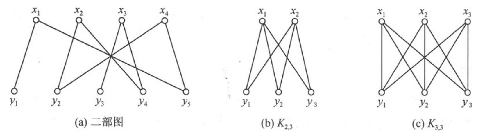
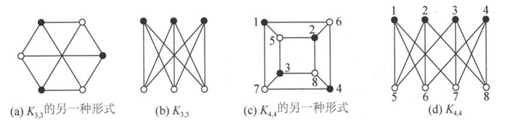
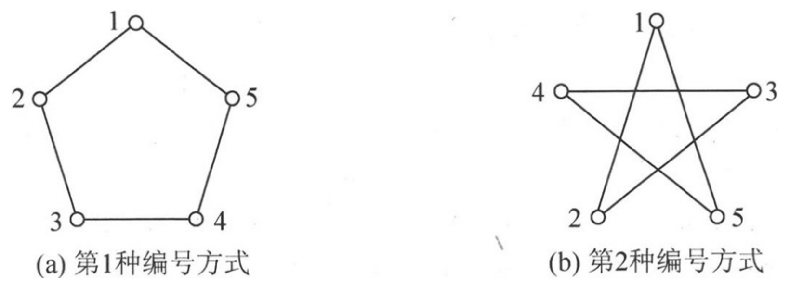
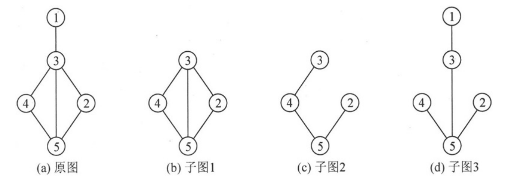

# 度
无向图中，一个顶点u的度数是与它相关联的边的数
目，记作deg(u)。

有向图中，顶点的度数等于该顶点的出度与入度之和，deg(u)＝od(u)＋id(u)。

偶点与奇点：为方便起见，把度数为偶数的顶点称为偶点
（Even Vertex），把度数为奇数的顶点称为奇点 （Odd Vertex）。

则： **每个图都有偶数个奇点**。因为如果有奇数个奇点，那么边的总数是奇数/2，不为整数。

在无向图和有向图中，所有顶点度数总和，等于边数的两
倍，即：
$$
m = \frac{1}{2} \left. \begin{matrix} \sum_{i=1}^{n}deg(u_i) \end{matrix} \right.\
$$

孤立顶点 （Isolated Vertex）：度数为0的顶点，称为孤立顶点。孤立顶点不与其他任何顶点邻接。

叶（Leaf）：度数为1的顶点，称为叶顶点，也称叶顶点
（Leaf Vertex）或端点 （End Vertex）。其他顶点称为非叶顶点 。

图G的最小度（Minimum Degree）：图G所有顶点的最小的度数，记为 δ(G)。

图G的最大度（Maximum Degree）：图G所有顶点的最大的度数，记为 ∆(G)。

## 度序列与Havel-Hakimi定理
度序列（Degree Sequence）：若把图G所有顶点的度数排成一个**序列**s，则称s为图G的度序列。

### 判断度序列
给定一个图，确定它的度序列很简单，但
是其逆问题并不容易，即给定一个由非负整数组成的有限序列s，判断s是否是某个图的度序列。

序列是可图的 （Graphic）：一个非负整数组成的有限序列如果是某个无向图的度序列，则称该序列是可图的。判定一个序列是否是可图的，有以下Havel-Hakimi定理。

### Havel-Hakimi定理
由非负整数组成的非增序列s：d1，d2 ，…，dn （n≥2，d1 ≥1）是可图的，当且仅当序列:
$$ s_1 = d_2 - 1,d_3-1,...,d_{d1+1} -1,d_{d1+2},...,d_n$$
是可图的。序列s1 中有n－1个非负整数，s序列中d1 后的前d1 个度数（即$d_{2}$ 到 $d_{d1＋1}$ ）减1后构成s1 中的前d1 个数。

**由同一个可图的序列构造出来的图不一定是唯一的。**

# 二部图与完全二部图
设无向图为G（V，E），它的顶点集合V包含两个没有公共元素的子集：X＝｛x1 ，x2 ，…，xs ｝和Y＝｛y1 ，y2 ，…，yt ｝，元素个数分别为s和t；并且xi 与xj 之间（1≤i，j≤s）、yl 与yr 之间（1≤l，r≤t）没有边连接，则称G为二部图，也称为二分图 。

在二部图G中，如果顶点集合X中每个顶点xi 与顶点集合Y中每个顶点yl 都有边相连，则称G为完全二部图，记为$K_{s,t}$，s和t分别为集合X和集合Y中的顶点个数。在完全二部图s，t 中一共有s×t条边。

## 二部图的判定
一个无向图G是二部图当且仅当G中无奇数长度的回路

# 图的同构
有些图之间看起来差别很大，但经过改画后，它们实际上是同一个图。

设有两个图G1 和G2 ，如果这两个图区别仅在于图的画法与（或）顶点的标号方式，则称它们是同构的。

# 子图和生成树
设有两个图G（V，E）和G′（V′，E′），如果V′⊆V，且E′⊆E，则称图G′是图G的子图 （Subgraph）

一个无向连通图的生成树是它的包含所有顶点的极小连通子图，这里所谓的极小就是边的数目极小。

如果图中有n个顶点，则生成树有n－1条边。一个无向连通图可能有多个生成树。

## 诱导子图

设图G′（V′，E′）是图G（V，E）的子图，且对于V′中的任意两个顶点u和v，只要（u，v）是G中的边，则一定是G′中的边，此时称图G′为由顶点集合V′诱导的G的子图 （Subgraph of G Induced By V′），简称为顶点诱导子图 （Vertex-Induced Subgraph），记为G［V′］。

根据定义，在图中，图（b）是由V′＝｛2，3，4，5｝诱导的子图，图（c）和图（d）都不是顶点诱导子图。

# 路径
在图G（V，E）中，若从顶点vi 出
发，沿着一些边经过一些顶点vp1 ，vp2 ，…，vpm ，到达顶点vj ，则称
顶点序列（vi ，vp1 ，vp2 ，…，vpm ，vj ）为从顶点vi 到顶点vj 的一条
路径 （Path），或称为通路 ，其中（vi ，vp1 ），（vp1 ，vp2 ），…，
（vpm ，vj ）为图G中的边。如果G是有向图，则＜vi ，vp1 ＞，＜vp1 ，
vp2 ＞，…，＜vpm ，vj ＞为图G中的有向边。

路径长度 （Length）：路径中边的数目通常称为路径的长度。

简单路径 （Simple Path）：若路径上各顶点vi ，vp1 ，vp2 ，…，vpm，vj均互相不重复，则这样的路径称为简单路径。

回路 （Circuit）：若路径上第一个顶点vi 与最后一个顶点vj 重合，
则称这样的路径为回路。

简单回路 （Simple Circuit）：除第一个和最后一个顶点外，没有顶点重复的回路称为简单回路。简单回路也称为圈 （Cycle）。长度为奇数的圈称为奇圈（OddCycle），长度为偶数的圈称为偶圈（Even Cycle）。

# 连通性
在无向图中，若从顶点u到v有路径，则称顶点u和v是连通 （Connected）的。如果无向图中任意一对顶点都是连通的，则称此图是连通图 （Connected Graph）；相反，如果一个无向图不是连通图，则称为非连通图 （Disconnected Graph）。

如果一个无向图不是连通的，则其极大连通子图称为连通分量（Connected Component），这里所谓的极大是指子图中包含的顶点个数极大。

在有向图中，若对每一对顶点u和v，既存在从u到v的路径，也存在从v到u的路径，则称此有向图为强连通图（Strongly Connected Digraph）。

对于非强连通图，其极大强连通子图称为其强连通分量（Strongly Connected Component）。

# 权值、有向网与无向网
权值 （Weight）：某些图的边具有与它相关的数，称为权值。这些权值可以表示从一个顶点到另一个顶点的距离、花费的代价、所需的时间等。如果一个图，其所有边都具有权值，则称为加权图（Weighted Graph），或者称为网络 （Net）。

根据网络中的边是否具有方向性，又可以分为有向网 （Directed Net）和无向网 （Undirected Net）。

# 图的存储
## 邻接矩阵
在邻接矩阵存储方法中，除了一个记录各个顶点信息的顶点数组外，还有一个表示各个顶点之间关系的矩阵，称为邻接矩阵 。设G（V，E）是一个具有n个顶点的图，则图的邻接矩阵是一个n×n的二维数组。

在网的存储中，矩阵中存储的不再只是0，1，而是一个权重，可以使用极限值来表示连接关系。

对无向图：
$$
deg(i) =  \left. \begin{matrix} \sum_{j=0}^{n-1}Edge[i][j] \end{matrix} \right.\
$$

对有向图，出度和入度分别为：
$$
od(i) =  \left. \begin{matrix} \sum_{j=0}^{n-1}Edge[i][j] \end{matrix} \right.\
\newline
  
\newline
id(i) =  \left. \begin{matrix} \sum_{j=0}^{n-1}Edge[j][i] \end{matrix} \right.\
$$

Q1 : 给定一个图的节点数量和每个节点的度，判断是否可图，并构造一个图（不唯一）。

## 邻接表
邻接矩阵无法存储带自身环（或重边）的图（重边指的是多条边的起点和终点均相同，也称为平行边。），所以有时不得不采用邻接表来存储图。当图的边数（相对于邻接矩阵中的元素个数，即n×n）较少时，使用邻接矩阵存储会浪费较多的存储空间，而用邻接表存储可以节省存储空间。

邻接表 （Adjacency list）： 把从同一个顶点发出的边连接在同一个称为边链表的单链表中。边链表的每个结点代表一条边，称为边结点 。

时间复杂度：
邻接表里直接存储了边的信息，浏览完所有的边，对
有向图来说，时间复杂度是O（m），对无向图时间复杂度是
O（2m）。而邻接矩阵是间接存储边，浏览完所有的边，复杂度是
O（n^2 ）。

空间复杂度： 邻接表里除了存储m条边所对应的边结点外，还需要一个顶点数组，存储各顶点的顶点信息及各边链表的表头指针，总的空间复杂度为O（n＋m）（或O（n＋2m））；而用邻接矩阵存储图，需要n×n规模的存储单元，其空间复杂度为O（n^2 ）。当边的数目相对于n×n比较小时，邻接矩阵里存储了较多的无用信息，用邻接表可以节省较多的存储空间。

