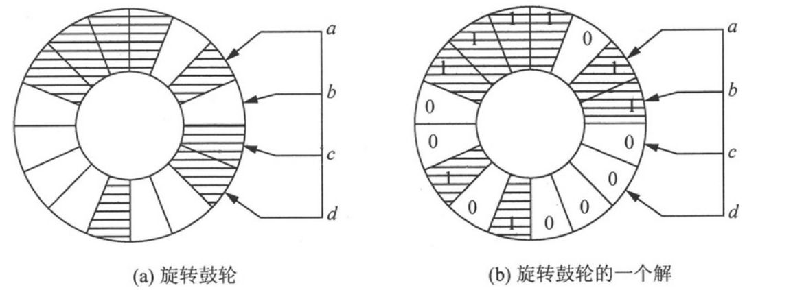
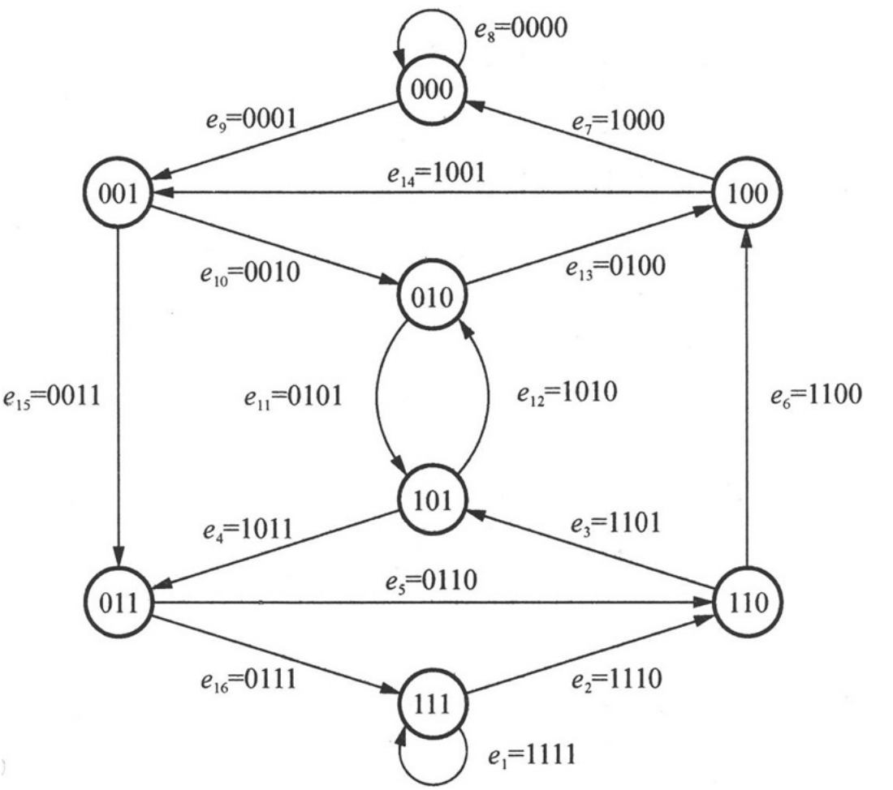

可行遍性问题：从图中一个顶点出发不重复地遍历完所有的边或所有的顶点并回到起始顶点，这两种回路分别是欧拉回路和汉密尔顿回路。

# 欧拉回路
无向图：
1. 设G是连通无向图，则称经过G的每条边一次并且仅一次的路径为欧拉通路 ；
2. 如果欧拉通路是回路（起点和终点是同一个顶点），则称此回路为欧拉回路 （Euler Circuit）；
3. 具有欧拉回路的无向图G称为欧拉图 （Euler Graph）。

有向图
1. 设D是有向图，D的基图连通，则称经过D的每条边一次并且仅一次的有向路径为有向欧拉通路 ；
2. 如果有向欧拉通路是有向回路，则称此有向回路为有向欧拉回路（Directed Euler Circuit）；
3. 具有有向欧拉回路的有向图D称为有向欧拉图 （Directed Euler Graph）。

## 欧拉通路和欧拉回路的判定
无向图G存在欧拉通路的充要条件是：**G为连通图，并且G仅有两个奇度结点（度数为奇数的顶点）或者无奇度结点。**

推论：
1. 当G是仅有两个奇度结点的连通图时，G的欧拉通路必以此两个结点为端点。
2. 当G是无奇度结点的连通图时，G必有欧拉回路。
3. **G为欧拉图（存在欧拉回路）的充分必要条件是G为无奇度结点的连通图。**

有向图D存在欧拉通路的充要条件是：**D为有向图，D的基图连通，并且所有顶点的出度与入度都相等；或者除两个顶点外，其余顶点的出度与入度都相等，而这两个顶点中一个顶点的出度与入度之差为1，另一个顶点的出度与入度之差为-1。**

推论：
1. 当D除出、入度之差为1，-1的两个顶点之外，其余顶点的出度与入度都相等时，D的有向欧拉通路必以出、入度之差为1的顶点作为始点，以出、入度之差为-1的顶点作为终点。
2. 当D的所有顶点的出、入度都相等时，D中存在有向欧拉回路。
3. **有向图D为有向欧拉图的充分必要条件是D的基图为连通图，并且所有顶点的出、入度都相等。**

QS: 旋转鼓轮的设计

旋转鼓轮，其表面被分为2^4个部分，每一部分用绝缘体或导体（阴影部分表示导体）组成，绝缘体部分给出信号0，导体部分给出信号1。问：鼓轮上16个部分应该怎样设计，才能使得鼓轮旋转一周，4个触点得到的一组4位二进制信息都不同？

ANS: 

要使得鼓轮旋转一周，得到的16组二进制信息都不同，唯一的可能是每种组合出现一次且仅一次，并且前一组信息的后3位跟后一组信息的前3位相同。如果把这3位信息看成一个图中顶点，那么，前后两组信息可以看成是这个顶点延伸出的边。

设有8个顶点的有向图，如图5.5所示，顶点记为｛000，001，010，011，100，101，110，111｝。对每个顶点a1 a2 a3 （a1 、a2 、a3 为0或1），可引出两条有向边，终点分别是a2 a3 0和a2 a3 1，这两条边分别记为a1 a2 a3 0和a1 a2 a3 1。这样，一共有16条边，并且各不相同，因此鼓轮问题中的16个不同的4位二进制对应于图中的一个欧拉回路。找到图中一条欧拉回路，并取每条边上的第1位构成16位二进制位，这样，构成的鼓轮中不存在相同的4位二进制。

找一种9个a、9个b、9个c的圆形排列，使由字母｛a，b，c｝组成的长度为3的27个字符串中的每个字符串仅出现一次。

## 欧拉回路的求解
欧拉回路的求解主要有两种方法：DFS搜索及Fleury（佛罗莱）算法。

### DFS
利用欧拉定理判断出一个图存在欧拉通路或回路后，选择一个正确的起始顶点，用DFS算法遍历所有的边（每条边只遍历一次），遇到走不通就回退。在搜索前进方向上将遍历过的边按顺序记录下来。这组边的排列就组成了一条欧拉通路或回路。

### Fleury（佛罗莱）算法
没懂，DFS肯定可以输出欧拉通路或回路（如果有）。

# 中国邮递员问题
中国邮路问题的实际模型是：一位邮递员从邮局准备好邮件去投递，然后返回邮局。他必须经过由他负责投递的每条街道**至少一次**，现需要为这位邮递员设计一条投递线路，使其总耗时最少。

如果图为欧拉图，那么邮递员从邮局出发，沿着一条欧拉回路最终回到邮局，总耗时肯定最少，如果不是，必然有一些街道要走不止一次。重复走某条街道相当于在图中为该街道添加一条重边。问题转换成：如果在图中添加一些重边，构造成一个欧拉图并添加边的距离长度总和最短。

在添加重边时，很明显应该选择为某个奇度顶点添加重边，如果重边的另一个顶点也是奇度顶点，那么这条重边将这两个奇度顶点变成偶度顶点；如果重边的另一个顶点是偶度顶点，则添加重边后，还必须从偶度顶点（该偶度顶点现在已经变成奇度顶点了）出发再添加一条重边与其他一个奇度顶点相连。

添加重边时要注意两个原则：
1. 不能出现重复添加重边，重复的重边应成对去掉，这样并不改变每一顶点的奇偶性；
2. 每一个圈上添加的重边总长不能超过圈长一半，否则应将此圈上添加的重边去掉，改在此圈上原来没有添加重边的路线上添加重边，这样也不改变每一顶点的奇偶性。

以上两个原则既保证了不改变每个顶点的奇偶性，又保证了添加重边的总长最短。

# 汉密尔顿回路
汉密尔顿通路 ：给定图G，若存在一条经过图中的每个顶点一次且仅一次的通路，则称这条通路为汉密尔顿通路

汉密尔顿回路（Hamilton Circuit）：若存在一条回路，经过图中的每个顶点一次且仅一次，则称这条回路为汉密尔顿回路

汉密尔顿图（Hamilton Graph）：具有汉密尔顿回路的图称为汉密尔顿图

对汉密尔顿回路，迄今为止还没有一个有效的判别方法，只是分别地给定了一些充分条件或必要条件，用这些条件来判定给定的图是否是汉密尔顿图，只能在特定的情形下才有效。

充分条件：
1. 设G是具有n个顶点的简单图，如果G中每一对顶点度数之和大于等于n－1，则在G中存在一条汉密尔顿回路。
2. 设G是具有n个顶点的简单图，如果G中每一对顶点度数之和大于等于n，则在G中存在一条汉密尔顿回路。
