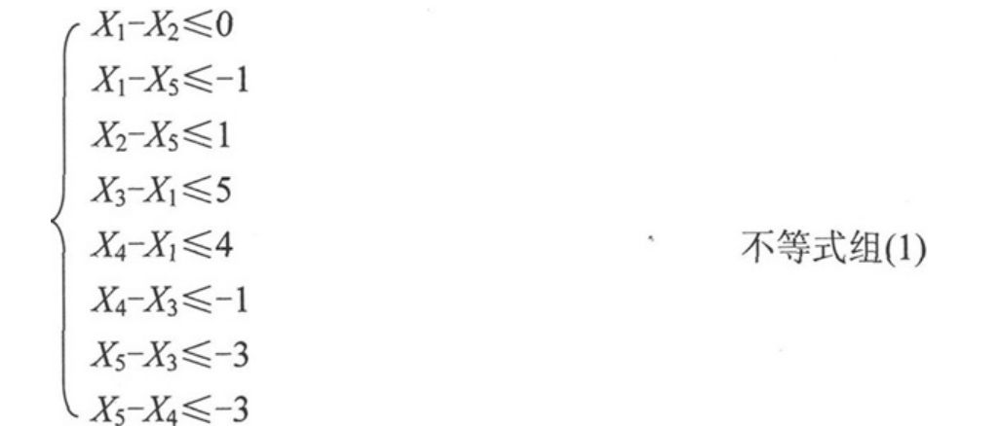
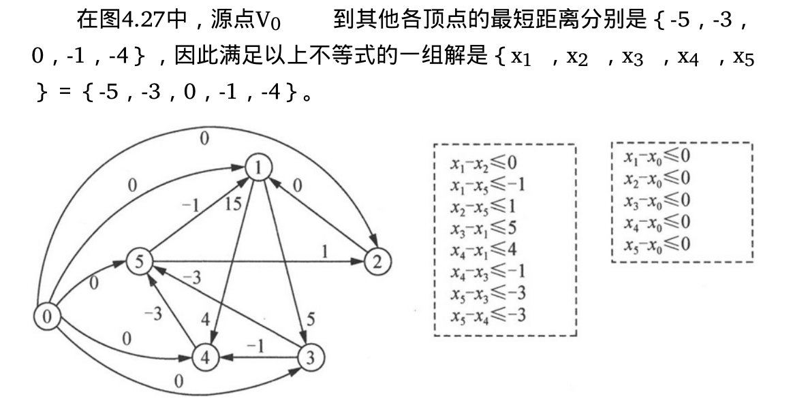

# Dijkstra算法
**边上权值非负情形的单源最短路径问题**

给定一个带权有向图（即有向网）G和源点v0，求v0到G中其他每个顶点的最短路径。（限定各边上的权值大于或等于0。）

Dijkstra算法的具体实现方法如下。
1. 设置两个顶点的集合T和S。S中存放已找到最短路径的顶点，初始时，集合S中只有一个顶点，
即源点v0。T中存放当前还未找到最短路径的顶点。
2. 在T集合中选取当前长度最短的一条最短路径（v0
，…，vk），从而将vk 加入到顶点集合S中，并修改源点v0 到T中各顶点的最短路径长度；重复这一步骤，直到所有的顶点都加入到集合S中，算法就结束了。

# Bellman-Ford算法
**边上权值为任意值的单源最短路径问题**

为了能够求解边上带有负权值的单源最短路径问题，Bellman（贝尔曼）和Ford（福特）提出了从源点逐次途经其他顶点，以缩短到达终点的最短路径长度的方法。**该方法也有一个限制条件：要求图中不能包含权值总和为负值的回路。**

# SPFA算法
Bellman-Ford算法的改进

Bellman-Ford算法的时间复杂度比较高，为O（n^3 ）或O（nm），原因在于Bellman-Ford算法要递推n次，每次递推，扫描所有的边，在递推n次的过程中很多判断是多余的。SPFA（Shortest Path Faster Algorithm）算法 是Bellman-Ford算法的一种队列实现，减少了不必要的冗余判断。

SPFA算法的大致流程是用一个队列来进行维护。初始时将源点加入队列。每次从队列中取出一个顶点，并对所有与它相邻的顶点进行松弛，若某个相邻的顶点松弛成功，则将其入队。重复这样的过程直到队列为空时算法结束。

# Floyd算法
所有顶点之间的最短路径

已知一个有向网（或无向网），对每一对顶点vi≠vj ，要求求出vi 与vj 之间的最短路径和最短路径长度。

**与Bellman-Ford算法类似，Floyd算法允许图中有带负权值的边，但不允许有包含负权值回路。**

Floyd（弗洛伊德）算法的基本思想是：对一个顶点个数为n的有向网（或无向网），设置一个n×n的方阵A（k），其中除对角线的矩阵元素都等于0外，其他元素A（k）［i］［j］（i≠j）表示从顶点vi 到顶点vj 的有向路径长度，k表示运算步骤，k＝-1，0，1，2，…，n－1。

初始时：A（-1） ＝Edge（图的邻接矩阵），即初始时，以任意两个顶点之间的直接有向边的权值作为最短路径长度。
1. 对于任意两个顶点vi 和vj ，若它们之间存在有向边，则以此边上的权值作为它们之间的最短路径长度。
2. 若它们之间不存在有向边，则以MAX作为它们之间的最短路径。

以后逐步尝试在原路径中加入其他顶点作为中间顶点，如果增加中间顶点后，得到的路径比原来的最短路径长度减少了，则以此新路径代替原路径，修改矩阵元素，更新为新的更短的路径长度。

1. A（-1）［i］［j］＝Edge［i］［j］
2. A（k）［i］［j］＝min｛A（k－1）［i］［j］，A（k－1）［i］［k］＋A（k－1）［k］［j］｝，k＝0，1，…，n－1

# 差分约束系统
假设有这样一组不等式：

每个不等式都是两个未知数的差小于等于某个常数（大于等于也可以，因为左右乘以-1就可以化成小于等于）。这样的不等式组就称作差分约束系统 （System Of Difference Constraints）。

这个不等式组要么无解，要么就有无数组解。

差分约束系统的求解要利用单源最短路径问题中的三角形不等式（Triangle Inequality）。即对于有向网（或无向网）中的任何一条边＜u，v＞，都有：d（v）≤d（u）＋Edge［u］［v］式中，d（u）和d（v）是求得的从源点分别到顶点u和顶点v的最短路径的长度；Edge［u］［v］是边＜u，v＞的权值。

## 有向网的构造
构造方法如下。
1. 每个不等式中的每个未知数Xi 对应图中的一个顶点Vi ；
2. 把所有不等式都化成图中的一条边。对于不等式Xi-Xj ≤c，把它化成三角形不等式：Xi ≤Xj ＋c，就可以化成边＜Vj ，Vi ＞，权值为c。

最后，在这张图上求一次单源最短路径，这些三角形不等式就都全部都满足了，因为它是最短路径问题的基本性质。

进一步：增加源点。所谓单源最短路径，当然要有一个源点，然后再求这个源点到其他所有顶点的最短路径。那么源点在哪呢？不妨自己造一个。以上面的不等式组为例，就再新加一个未知数X0 。

**差分约束系统也有可能出现无解的情况，也就是从源点到某一个顶点不存在最短路径**

